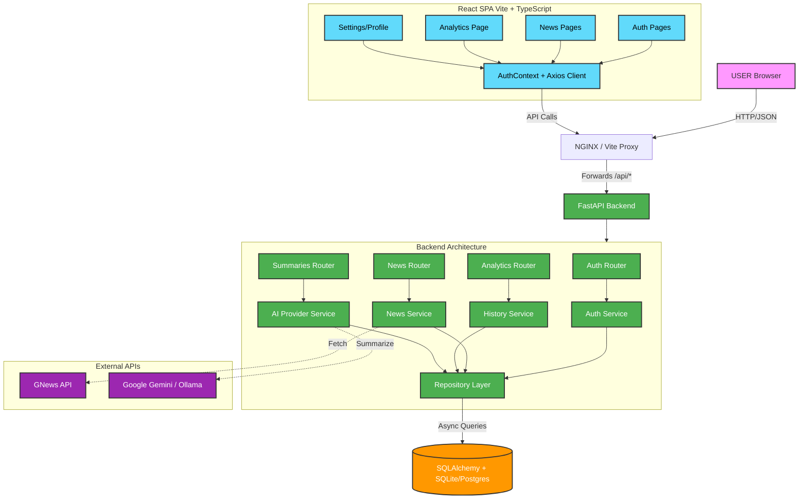
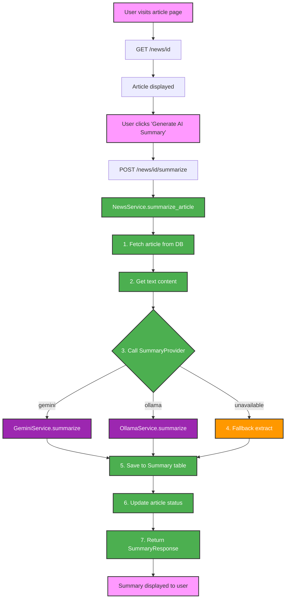
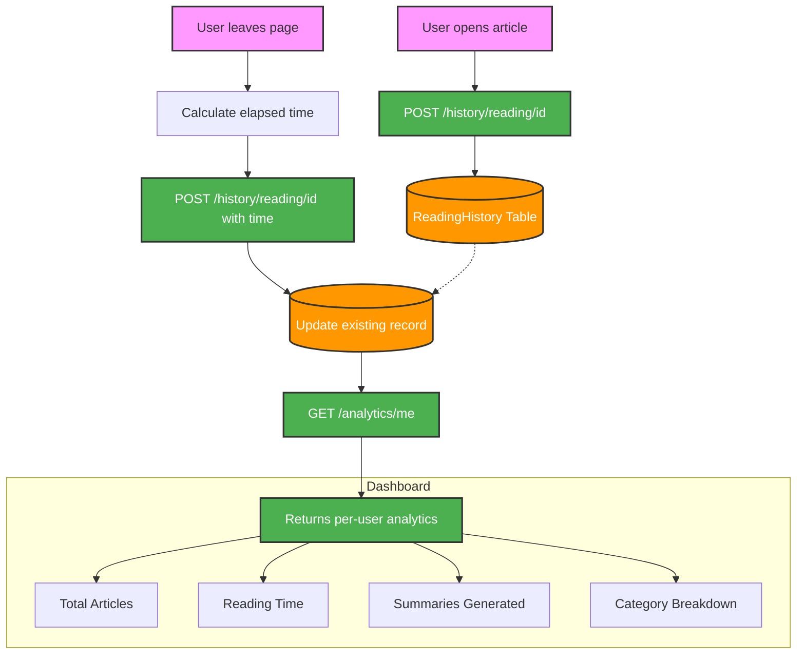
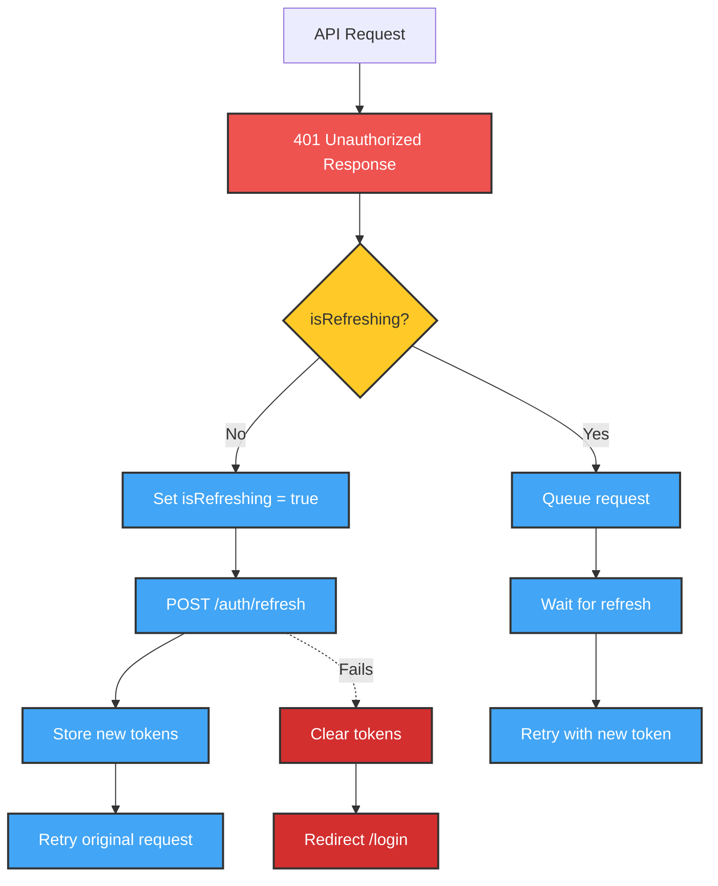

# BrieflyAI — AI News Summarizer

**BrieflyAI** is a full-stack, enterprise-grade application that aggregates global news articles from multiple sources and delivers concise, AI-generated summaries using **Google Gemini** or **Ollama** (local LLM). It provides a personalized reading experience with per-user analytics, reading time tracking, bookmarks, history, and interactive data visualizations.

> **Mission**: Save readers hours by distilling news articles into 3-5 sentence AI summaries, while tracking reading habits to provide actionable insights.

---

## System Architecture & Data Flow



---

## AI Summarization Flow



---

## Reading Time & Analytics Tracking Flow



---

## Tech Stack — Why Each Technology

| Technology | Version | Purpose |
|-----------|---------|---------|
| **React** | 19 | Component-based UI framework for building interactive dashboards |
| **TypeScript** | ~5.7 | Static typing for catch errors at compile time, not runtime |
| **Vite** | 8 | Ultra-fast dev server with HMR and optimized production builds |
| **React Router** | 7 | Client-side routing with layout nesting and auth guards |
| **Recharts** | 2 | Declarative chart library for analytics (bar, pie, line) |
| **Axios** | 1 | HTTP client with interceptors for JWT refresh queue |
| **Lucide React** | — | Lightweight, consistent icon set |
| **FastAPI** | 0.115 | High-performance async Python web framework |
| **SQLAlchemy** | 2.0 | Async ORM with repository pattern for clean data access |
| **Pydantic** | 2 | Request/response validation with auto-generated OpenAPI docs |
| **Python-JOSE** | 3 | JWT creation and validation for stateless auth |
| **Passlib (bcrypt)** | 1.7 | Password hashing with automatic salt |
| **Google GenAI** | — | Gemini API client for AI-powered summarization |
| **Ollama** | — | Local LLM alternative (Gemma 2:2B) for offline use |
| **GNews API** | — | Free news aggregation source |
| **Alembic** | 1.13 | Database migration management |
| **Docker** | — | Containerization for reproducible deployments |
| **Nginx** | — | Production reverse proxy and static file serving |

---

## Key Features

### 1. Authentication & Profile Management
- JWT-based auth with access + refresh token rotation
- Token refresh queue in Axios interceptor (no race conditions)
- Profile image upload with instant sync across all UI (header, mobile nav, settings)
- Settings page: Edit email, username, full name; change password; view account info
- Dropdown profile menu: Settings, Help Center, Logout

### 2. News Aggregation & AI Summarization
- Fetch real news from GNews API across 8 categories
- Fallback AI-generated mock articles for development/testing
- Two AI providers: **Google Gemini** (cloud) and **Ollama** (local, free)
- Local fallback summarization (first 100 words) when AI is unavailable
- Summary variants: bullet points, keywords, sentiment, reading time

### 3. Analytics Dashboard (Per-User)
- **Bar Chart**: Daily reading activity (articles read + time spent) — last 7 days
- **Pie Chart**: Category breakdown of articles read
- **Horizontal Bar Chart**: Top 10 most-read articles with time investment
- **Line Chart**: Reading time trend over time
- **Stats Cards**: Total articles read, total reading time, summaries generated, categories explored
- Reading time tracked in real-time: starts when article loads, captured on leave

### 4. User History & Bookmarks
- Reading history with article title, category, image, and time spent
- Search history tracking
- Bookmark articles for later reading
- Paginated history views

### 5. Edge Case Handling
| Scenario | Handling |
|----------|----------|
| API failure | Error banners with retry button, never crashes |
| Loading state | Animated skeleton placeholders (shimmer effect) |
| Empty data | Illustrated empty states with actionable CTAs |
| Token expired | Auto-refresh via interceptor queue; redirect to login |
| Image load fail | Graceful fallback to initial avatar |
| Network offline | Axios timeout + error display |
| Profile image upload | Size/type validation, instant context sync |
| Race conditions | AbortController on unmount, cancelled flag pattern |

---

## API Endpoints

### Authentication (`/api/v1/auth`)
| Method | Path | Auth | Description |
|--------|------|------|-------------|
| POST | `/register` | No | Create account (email, username, password) |
| POST | `/login` | No | Get JWT access + refresh tokens |
| POST | `/refresh` | No | Refresh expired access token |
| POST | `/logout` | Yes | Clear session |
| GET | `/me` | Yes | Get current user profile |
| PUT | `/me` | Yes | Update profile (email, username, full_name) |
| POST | `/me/profile-image` | Yes | Upload profile photo (multipart) |
| POST | `/change-password` | Yes | Change password |

### News (`/api/v1/news`)
| Method | Path | Auth | Description |
|--------|------|------|-------------|
| GET | `/categories` | No | List available categories |
| GET | `/countries` | No | List available countries |
| GET | `/` | No | List articles (paginated, filterable) |
| GET | `/search` | Yes | Search articles with filters |
| GET | `/trending` | No | Trending articles |
| GET | `/{id}` | No | Get single article details |
| GET | `/{id}/summary` | No | Get existing AI summary |
| POST | `/{id}/summarize` | Yes | Generate AI summary for article |
| POST | `/seed/{category}` | Yes | Seed articles from GNews API |

### Analytics (`/api/v1/analytics`)
| Method | Path | Auth | Description |
|--------|------|------|-------------|
| GET | `/stats` | Yes | Global stats (articles, summaries, weekly, categories) |
| GET | `/categories` | Yes | Category distribution |
| GET | `/activity` | Yes | Summary creation activity timeline |
| GET | `/usage` | Yes | Usage counts (today, week, month, total) |
| GET | `/me` | Yes | **Per-user** analytics with reading time |

### History (`/api/v1/history`)
| Method | Path | Auth | Description |
|--------|------|------|-------------|
| GET | `/reading` | Yes | Reading history (enriched with article details) |
| GET | `/search` | Yes | Search history |
| GET | `/summary` | Yes | Summary history |
| POST | `/reading/{article_id}` | Yes | Record reading (with optional reading_time_seconds) |

### Bookmarks (`/api/v1/bookmarks`)
| Method | Path | Auth | Description |
|--------|------|------|-------------|
| GET | `/` | Yes | List user's bookmarks |
| POST | `/` | Yes | Add bookmark (article_id) |
| DELETE | `/{id}` | Yes | Remove bookmark |

### Preferences (`/api/v1/preferences`)
| Method | Path | Auth | Description |
|--------|------|------|-------------|
| GET | `/` | Yes | Get user preferences |
| PUT | `/` | Yes | Update preferences (categories, languages, summary_length) |

### Admin (`/api/v1/admin`)
| Method | Path | Auth | Description |
|--------|------|------|-------------|
| GET | `/users` | Superuser | List all users |
| GET | `/users/{id}` | Superuser | Get user details |
| PUT | `/users/{id}` | Superuser | Update user |
| DELETE | `/users/{id}` | Superuser | Delete user |
| GET | `/stats` | Superuser | System statistics |

---

## Quick Start

### Docker (Recommended)
```bash
docker-compose up --build
```
- Frontend: http://localhost
- Backend API: http://localhost:8000
- API Docs (Swagger): http://localhost:8000/docs

### Manual Setup

#### Prerequisites
- Node.js 18+
- Python 3.10+
- (Optional) Ollama running locally for AI summaries

#### Backend
```bash
cd backend
python -m venv venv
venv\Scripts\activate      # Windows
# source venv/bin/activate  # macOS/Linux
pip install -r requirements.txt
cp .env.example .env
# Edit .env: set GEMINI_API_KEY or configure Ollama
uvicorn app.main:app --reload
```

#### Frontend
```bash
cd frontend
npm install
npm run dev
```
Frontend runs on http://localhost:5173 with Vite proxy forwarding `/api` to port 8000.

### AI Provider Configuration

Set `SUMMARY_PROVIDER` in `backend/.env`:

| Provider | Value | Requirements |
|----------|-------|-------------|
| Google Gemini | `gemini` | Set `GEMINI_API_KEY` (get from [aistudio.google.com](https://aistudio.google.com)) |
| Ollama (Local) | `ollama` | Install Ollama, pull a model: `ollama pull gemma2:2b` |

---

## Project Structure

```
D:\AI News Summarizer\
├── frontend/                    # React + TypeScript SPA
│   ├── src/
│   │   ├── components/          # Reusable UI (Button, Badge, ArticleCard, ArticleModal)
│   │   ├── contexts/            # AuthContext (JWT state), ThemeContext (dark/light)
│   │   ├── hooks/               # useDocumentTitle
│   │   ├── layouts/             # AppLayout (authenticated shell), AuthLayout, MarketingLayout
│   │   ├── pages/               # All route pages (14 pages)
│   │   ├── services/            # Axios instance with token refresh interceptor
│   │   ├── styles/              # CSS design tokens (light/dark theme)
│   │   ├── config.ts            # Backend URL helper
│   │   ├── App.tsx              # Router + context providers
│   │   └── main.tsx             # Entry point
│   ├── vite.config.ts           # Dev proxy configuration
│   └── package.json
│
├── backend/                     # FastAPI Python backend
│   ├── app/
│   │   ├── api/endpoints/       # Route handlers (10 modules)
│   │   ├── config/              # Pydantic Settings (env vars)
│   │   ├── core/                # Security (JWT), dependencies, exception handlers
│   │   ├── database/            # Async SQLAlchemy engine + session
│   │   ├── models/              # ORM models (User, NewsArticle, Summary, etc.)
│   │   ├── repositories/        # Data access layer (CRUD)
│   │   ├── schemas/             # Pydantic request/response schemas
│   │   ├── services/            # Business logic
│   │   └── middleware/          # CORS, logging, rate limiting
│   ├── alembic/                 # DB migration scripts
│   ├── requirements.txt
│   └── Dockerfile
│
├── docker-compose.yml           # Orchestrates backend + frontend
├── run_project.bat / .ps1       # One-click start scripts
└── README.md
```

---

## Development Notes

### Reading Time Calculation
- Reading time is measured in **real seconds** the user spends on the article page
- Timer starts when the article content finishes loading
- Timer stops when the user navigates away (unmount)
- Data is sent via `POST /history/reading/{id}` with `{ reading_time_seconds: N }`
- The backend updates the existing record (or creates new if first view)

### Analytics Data Sources
| Metric | Source Table | Calculation |
|--------|-------------|-------------|
| Articles Read | `reading_history` | COUNT by user_id |
| Reading Time | `reading_history.reading_time_seconds` | SUM by user_id |
| Summaries Generated | `summaries` | COUNT where user_id matches |
| Category Breakdown | `reading_history` + `news_articles` | JOIN + GROUP BY category |
| Daily Activity | `reading_history` | COUNT + SUM grouped by DATE(read_at) |
| Top Articles | `reading_history` + `news_articles` | COUNT + SUM grouped by article |

### Token Refresh Flow



---

## Security Considerations

- JWT secret key should be changed from default in production
- Test login endpoint disabled in production environments
- Profile image upload validates MIME type (must start with `image/`)
- Password reset tokens are time-limited (15 minutes) and one-time use
- Rate limiting on API endpoints (60 requests/minute by default)
- CORS restricted to known origins
- No sensitive data in logs (passwords filtered via Pydantic)

---

## Performance Optimizations

- **Frontend**: Vite code splitting, lazy loading ready, CSS custom properties for theme
- **Backend**: Async SQLAlchemy throughout, connection pooling, repository pattern with eager loading
- **Caching**: Browser caching for static assets via Nginx
- **Database**: Indexed columns (user_id, email, username, article_id, category)

---

## License

MIT

---

*Built with React 19, FastAPI, and Google Gemini/Ollama. Briefl yAI — Read less, know more.*
